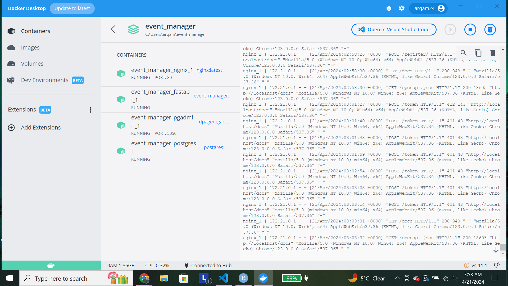

# Documention

## Issue1 
-[Issue_link](https://github.com/kjc47/event_manager/issues/1)

## Issue2 
-[Issue_link](https://github.com/kjc47/event_manager/issues/2)

## Issue3 
-[Issue_link](https://github.com/kjc47/event_manager/issues/3)

## Issue4 
-[Issue_link](https://github.com/kjc47/event_manager/issues/4)

## Issue5 
-[Issue_link](https://github.com/kjc47/event_manager/issues/5)

## Issue6 - Error from the video
Its already fixed by the professor and no changes are required for that issue.

## Image in docker

## What I learnt

I've been learning about REST APIs and getting better at documenting and testing software with tools like pytest. Working on real problems has been a great way to develop my problem-solving skills, even though debugging can still be tough. Collaborating with others has really helped me understand how everything fits together. I still have a lot to learn, but this experience is really helping me grow in API development and software testing, setting me up for the future.